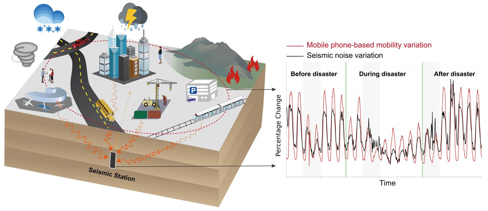
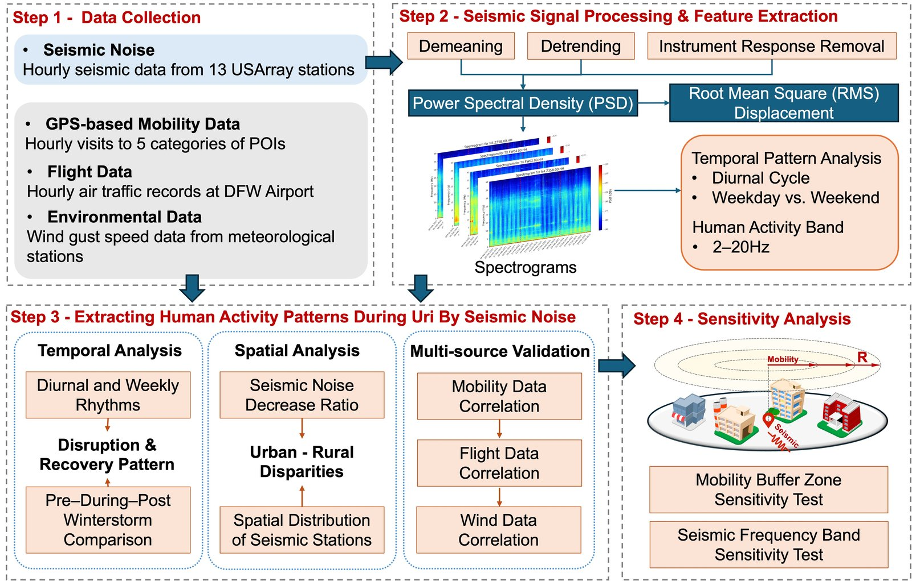
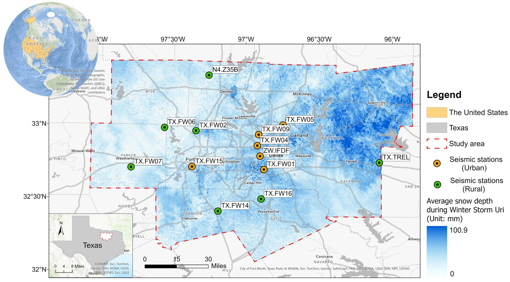
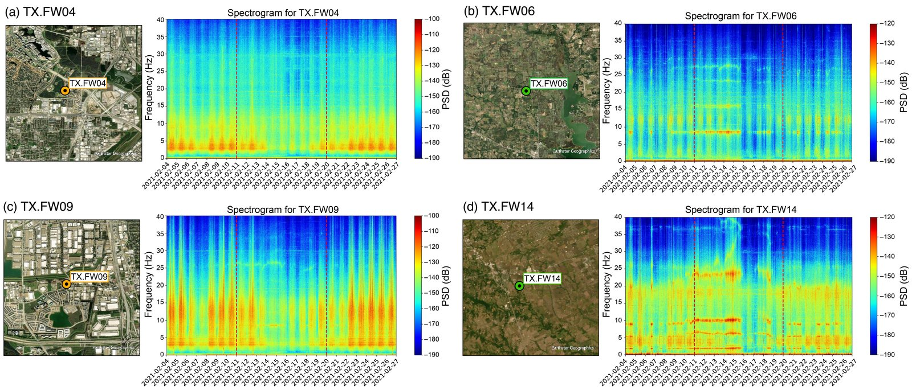
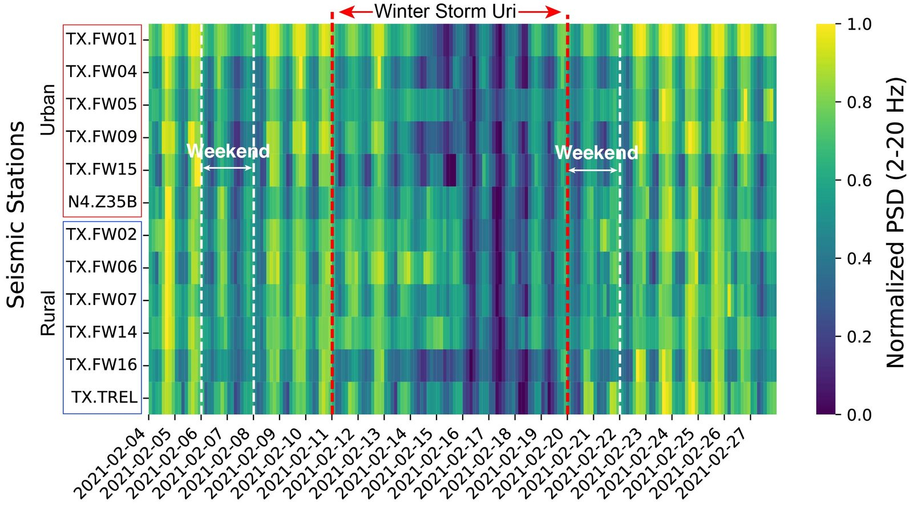
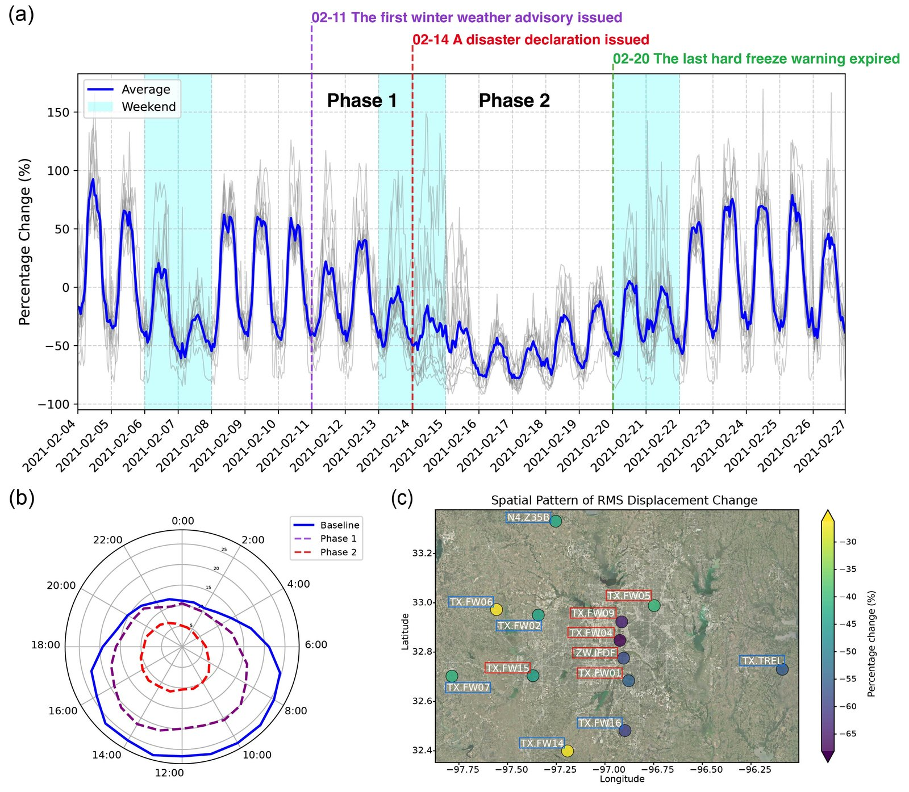
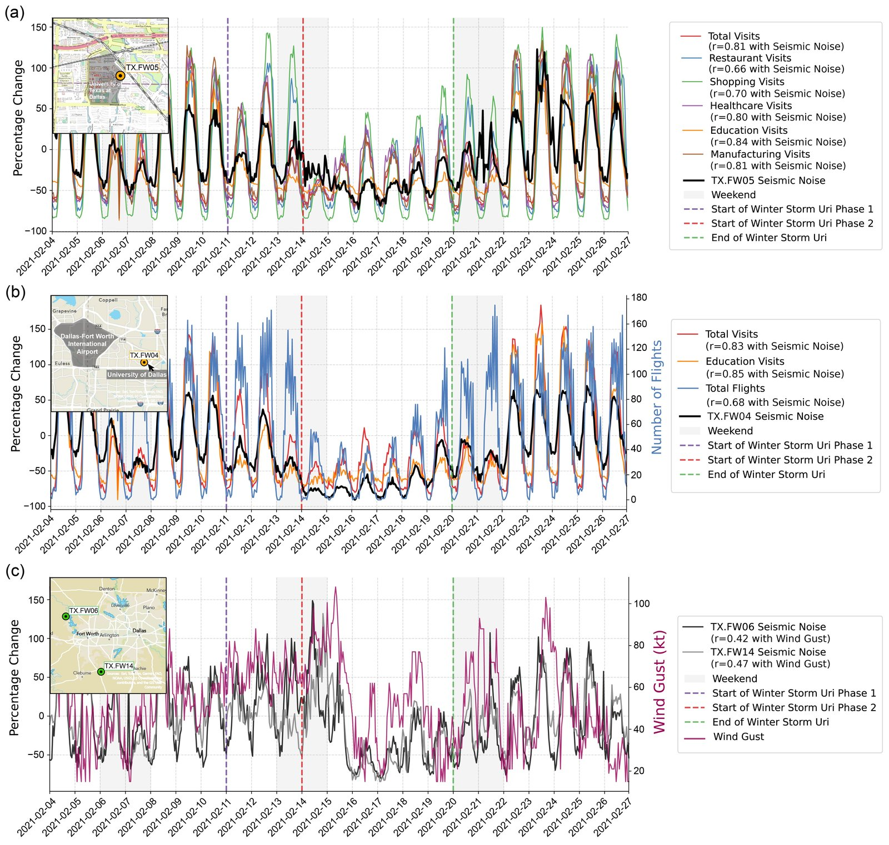
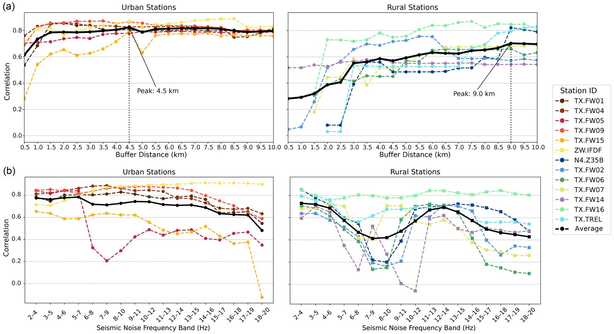

# From Seismic Signals to Urban Sensing

**Using ambient seismic noise to sense disruptions to human activity during extreme weather events**

<p align="center">
  
</p>

Human activity in cities (traffic, pedestrians, construction, industry) shakes the ground, and seismometers record this as continuous, high-frequency *ambient seismic noise*. This repository contains the code for our study of Winter Storm Uri (February 2021) in the Dallas–Fort Worth (DFW) metropolitan area, Texas. The study shows that noise from existing seismic stations tracks urban activity passively and continuously.

**Key findings**

- Seismic noise in the **2–20 Hz** band tracks human mobility, including diurnal and weekly rhythms, the abrupt drop during the storm, and the gradual recovery afterwards.
- Seismic noise correlates strongly with mobile-phone mobility data (**r > 0.8**) and agrees with air-traffic records at DFW airport.
- Rural stations respond more to environmental noise, mainly wind-driven vegetation.
- The correlation is strongest at specific buffer radii and frequency bands, which gives practical parameters for isolating human-related signals.

---

## Workflow

<p align="center">
  
</p>

The code follows the four steps in the figure. Each step is one module:

| Step | Module | What it does |
|---|---|---|
| 1 · Data collection | `seismic_processing.download_waveforms` | IRIS FDSN mass download of HHZ/BHZ data + StationXML |
| | `mobility.py` | SafeGraph/Advan weekly patterns → hourly POI visits around each station |
| | `environment.py` | NOAA wind gusts (nearest weather station), OpenSky flights at DFW, SNODAS snow depth |
| 2 · Signal processing | `seismic_processing.py` | response removal → Welch PSD (30-min windows, 50 % overlap) → displacement spectrum → hourly RMS displacement |
| 3 · Human-activity patterns | `analysis.py` | change relative to the pre-storm baseline, diurnal cycles, urban–rural contrasts, correlations with visits, flights and wind |
| 4 · Sensitivity | `sensitivity.py` | correlation as a function of buffer radius (0.5–10 km) and frequency band |

## Study area

<p align="center">
  
</p>

The study uses 13 broadband stations (networks TX, N4, ZW), shown against the mean snow depth during the storm (Feb 11–20, 2021). Six stations are in urban settings (TX.FW01, FW04, FW05, FW09, FW15, ZW.IFDF) and seven in rural settings (N4.Z35B, TX.FW02, FW06, FW07, FW14, FW16, TX.TREL).

## Results

### Spectral signature of human activity

<p align="center">
  
</p>

Panels (a) and (c) show the urban stations TX.FW04 and TX.FW09. Both have strong day–night cycles that weaken during the storm (between the red dashed lines). Panels (b) and (d) show the rural stations TX.FW06 and TX.FW14. They are quieter and dominated by narrow-band and environmental signals.

<p align="center">
  
</p>

This figure shows the normalised 2–20 Hz PSD for all 13 stations in 3-hour bins. The red dashed lines mark the storm period, and the white dashed lines mark weekends and holidays.

### Disruption and recovery

<p align="center">
  
</p>

The figure has three panels:

- **(a)** Percentage change in RMS displacement relative to the pre-storm baseline.
- **(b)** Diurnal RMS cycle for the baseline, Phase 1 and Phase 2.
- **(c)** Spatial pattern of the change across stations.

### Multi-source validation

<p align="center">
  
</p>

Seismic noise compared with POI visits, flights at DFW airport and wind gusts.

### Sensitivity analysis

<p align="center">
  
</p>

Correlation between RMS displacement and POI visits as a function of **(a)** buffer radius and **(b)** seismic frequency band. The mean correlation peaks at a **4.5 km** buffer for urban stations and a **9 km** buffer for rural stations.

---

## Repository structure

```
config.py               paths (via SEISMIC_DATA_ROOT), study periods, station groups, parameters
seismic_processing.py   download, PSD, displacement, RMS; PSD summaries
mobility.py             SafeGraph loading, weekly→hourly visits, buffers, POI composition
poi_categories.py       SafeGraph top_category → activity / functional groups
environment.py          wind (nearest station), DFW flights, SNODAS snow depth
analysis.py             temporal, spatial and validation analysis → result tables
sensitivity.py          buffer-radius and frequency-band sensitivity → result tables
run_pipeline.py         run everything or selected stages
docs/images/            figures shown in this README
```

## Getting started

```bash
conda create -n seismic python=3.10 -c conda-forge obspy geopandas gdal
conda activate seismic
pip install -r requirements.txt

export SEISMIC_DATA_ROOT=/path/to/data        # default: ./data
export SEISMIC_OUTPUT_DIR=/path/to/outputs    # default: ./outputs
export MONGO_URI=mongodb://localhost:27017/   # SafeGraph weekly patterns

python run_pipeline.py                        # full workflow
python run_pipeline.py --stages analysis sensitivity
```

`run_pipeline.py` has seven stages: `download`, `psd`, `rms`, `mobility`, `environment`, `analysis` and `sensitivity`. Each module can also be run on its own, for example `python analysis.py`.

The analysis tables are written to `outputs/`:

- `rms_percentage_change.csv`
- `rms_diurnal_profiles.csv`
- `rms_phase_change_by_station.csv`
- `validation_correlations.csv`
- `sensitivity_buffer.csv`
- `sensitivity_band.csv`
- and a few others

## Data

The data are **not** redistributed here. The expected file names are listed in `config.py`.

| Data | Source |
|---|---|
| Continuous waveforms and StationXML | [IRIS / EarthScope FDSN](https://service.iris.edu/) (downloaded automatically) |
| POI weekly patterns | [SafeGraph / Advan](https://doi.org/10.82551/X1PP-1F65) (licensed; academic access) |
| Hourly surface observations (wind gust) | NOAA NCEI Local Climatological Data |
| Flight list, Feb 2021 | OpenSky Network |
| Census block groups and population | U.S. Census Bureau |
| Daily snow depth | NSIDC SNODAS |

## Citation

The manuscript is currently under review. The citation will be added after publication.

## License

Code: MIT, see [LICENSE](LICENSE). Figures © the authors.

## Contact

Hao Tian — Texas A&M University · haotian@tamu.edu
